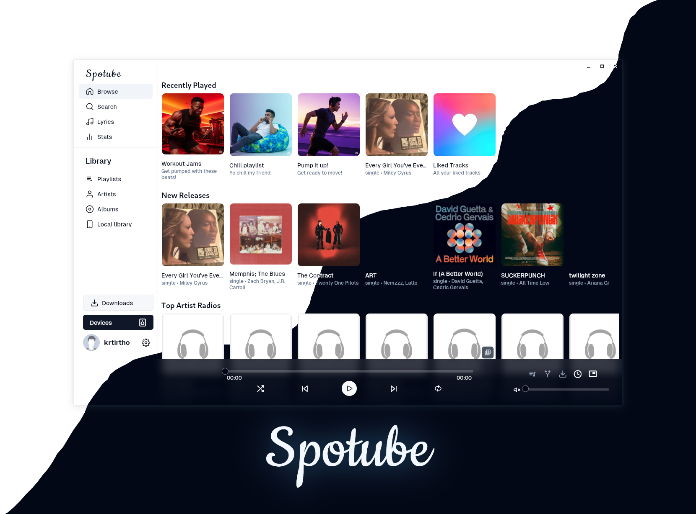

<div align="center">


# Melora

**Next-Gen Open-Source Music Streaming — No Boundaries.**

A cross-platform, plugin-powered music player.  
Bring your own metadata, playlists, and audio sources.

[](https://github.com/harshakalimireddi-collab/Melora-appplayer/releases/latest)
[](https://github.com/harshakalimireddi-collab/Melora-appplayer/releases)
[](LICENSE)

---



</div>

---

## 📥 Download

| Platform | Download | Format |
|----------|----------|--------|
| 🪟 **Windows** | [Download](https://github.com/harshakalimireddi-collab/Melora-appplayer/releases/latest/download/Melora-Windows-x64.zip) | `.zip` (portable) |
| 🤖 **Android** | [Download](https://github.com/harshakalimireddi-collab/Melora-appplayer/releases/latest/download/Melora-Android.apk) | `.apk` |
| 🐧 **Linux** | [Download](https://github.com/harshakalimireddi-collab/Melora-appplayer/releases/latest/download/Melora-Linux-x64.tar.gz) | `.tar.gz` |
| 🍎 **macOS** | [Download](https://github.com/harshakalimireddi-collab/Melora-appplayer/releases/latest/download/Melora-macOS.zip) | `.zip` |

> **Auto-Updates:** Melora checks for new releases on launch. When you push a new version, every user gets notified automatically.

---

## ✨ Features

| Feature | Description |
|---------|-------------|
| 🧩 **Plugin System** | Supports any music service through community or custom plugins |
| 🗺️ **Community Driven** | Growing library of plugins for popular platforms |
| ⬇️ **Free Downloads** | Download tracks with full tagged metadata |
| 🖥️📱 **Cross-Platform** | Windows, macOS, Linux, Android, iOS |
| 🪶 **Lightweight** | Small footprint, minimal data usage |
| 🕒 **Synced Lyrics** | Time-synced lyrics regardless of plugin |
| 🔒 **Privacy First** | Zero telemetry, zero data collection |
| 🚀 **Native Performance** | Built with Flutter — no Electron bloat |

---

## 🏗️ Project Structure

```
Melora-appplayer/
├── lib/                    # Dart/Flutter app source code
│   ├── collections/        # Icons, constants, enums
│   ├── components/         # Reusable UI widgets
│   ├── hooks/              # Custom Flutter hooks
│   ├── models/             # Data models
│   ├── modules/            # Feature modules (player, library, search, etc.)
│   ├── pages/              # App screens/routes
│   ├── provider/           # State management (Riverpod providers)
│   ├── services/           # Background services (audio, downloads)
│   └── utils/              # Utilities & helpers
│
├── android/                # Android platform config
├── ios/                    # iOS platform config
├── windows/                # Windows platform config
├── linux/                  # Linux platform config
├── macos/                  # macOS platform config
├── web/                    # Web platform config
│
├── assets/                 # Branding, icons, translations, plugins
├── website/                # Melora showcase & download website
│
├── .github/workflows/      # CI/CD pipelines
│   ├── build-and-release.yml   # Auto-build all platforms + create release
│   └── deploy-website.yml      # Auto-deploy website to GitHub Pages
│
├── pubspec.yaml            # Flutter dependencies
└── README.md               # You are here
```

---

## 🔄 How Auto-Updates Work

```
You push code → Tag a release (v4.1.0) → GitHub Actions builds all binaries
                                        → Creates a Release with downloads
                                        → Users open Melora → See "Update Available"
                                        → One tap → Updated!
```

The app checks `https://api.github.com/repos/harshakalimireddi-collab/Melora-appplayer/releases/latest` on every launch. If a newer version exists, it prompts the user to download the new binary.

---

## 🚀 Release a New Version

```bash
# 1. Make your changes
git add -A
git commit -m "Your changes"

# 2. Tag it
git tag v4.1.0

# 3. Push (triggers auto-build + auto-deploy)
git push origin main --tags
```

That's it. GitHub Actions handles the rest:
- ✅ Builds Windows `.exe`, Android `.apk`, Linux `.tar.gz`, macOS `.zip`
- ✅ Creates a GitHub Release with all binaries
- ✅ Deploys the website to GitHub Pages
- ✅ Every user gets notified of the update

---

## 🛠️ Development Setup

```bash
# Prerequisites: Flutter SDK 3.35+

# Clone
git clone https://github.com/harshakalimireddi-collab/Melora-appplayer.git
cd Melora-appplayer

# Install dependencies
flutter pub get

# Run (pick your platform)
flutter run -d windows
flutter run -d chrome
flutter run -d android
flutter run -d macos
flutter run -d linux
```

---

## 📄 License

Licensed under the [BSD-4-Clause License](LICENSE).

---

<div align="center">

**Built with 💜 by Harsha**

</div>
