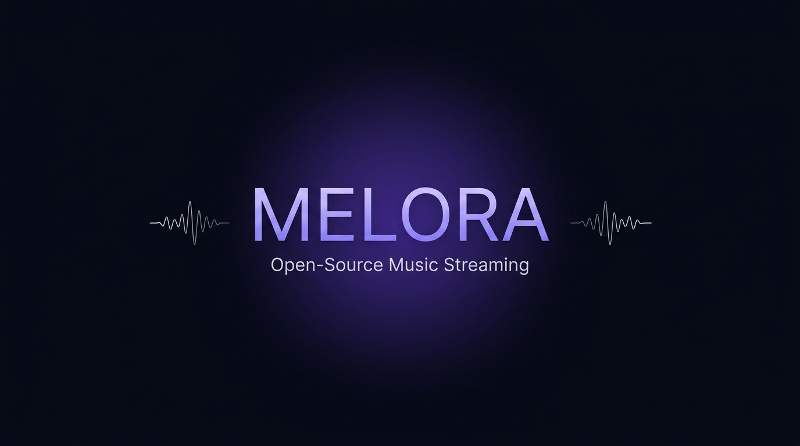

<div align="center">


# Melora

**Next-Gen Open-Source Music Streaming — No Boundaries.**

A cross-platform, plugin-powered music player with cinematic Obsidian Aurora Glass UI.  
Bring your own metadata, playlists, and audio sources. Zero ads. Zero tracking. Forever free.

[](https://github.com/harshakalimireddi-collab/Melora-appplayer/releases/latest)
[](https://github.com/harshakalimireddi-collab/Melora-appplayer/releases)
[](LICENSE)

🌐 **[Visit the Official Website →](https://harshakalimireddi-collab.github.io/Melora-appplayer/)**

---



</div>

---

## 📥 Download Melora

> **One click. No ads. No subscriptions. Every song, every device.**

| Platform | Download | Format |
|----------|----------|--------|
| 🪟 **Windows** | [**⬇ Download Installer**](https://harshakalimireddi-collab.github.io/Melora-appplayer/downloads/Melora-Windows-x64-Setup.exe) | `.exe` — Single-file Setup ✅ |
| 🤖 **Android** | [View Releases](https://github.com/harshakalimireddi-collab/Melora-appplayer/releases) | `.apk` — Coming Soon |
| 🍎 **macOS** | [View Releases](https://github.com/harshakalimireddi-collab/Melora-appplayer/releases) | `.dmg` — Coming Soon |
| 🐧 **Linux** | [View Releases](https://github.com/harshakalimireddi-collab/Melora-appplayer/releases) | `.AppImage` / `.deb` / `.rpm` — Coming Soon |

> 💡 **Auto-Updates:** Melora checks for new releases on launch. When a new version is available, you'll see it instantly.

---

## ✨ Features

| Feature | Description |
|---------|-------------|
| 🎵 **Bit-Perfect Lossless** | 24-bit / 96kHz playback with WASAPI and PipeWire hardware output |
| 🧩 **Plugin Architecture** | Extend audio sources, lyric providers, and integrations via sandboxed Dart plugins |
| 🔒 **Private & Ad-Free** | Zero telemetry, zero data collection, zero advertisements |
| 🎤 **Synchronized Lyrics** | Millisecond-accurate real-time lyrics with karaoke tracking |
| 📱 **Cross-Platform** | Windows, macOS, Linux, Android, iOS — one codebase |
| 🌊 **Obsidian Aurora Glass UI** | Cinematic dark glass interface with refined micro-animations |
| 📡 **Melora Connect** | Control desktop playback from your phone on local network |
| 🚀 **Native Performance** | Built with Flutter — no Electron bloat, instant startup |

---

## 🏗️ Project Structure

```
Melora-appplayer/
├── lib/                    # Dart/Flutter app source code
│   ├── collections/        # Icons, constants, enums
│   ├── components/         # Reusable UI widgets
│   ├── hooks/              # Custom Flutter hooks
│   ├── models/             # Data models
│   ├── modules/            # Feature modules (player, library, search, etc.)
│   ├── pages/              # App screens/routes
│   ├── provider/           # State management (Riverpod providers)
│   ├── services/           # Background services (audio, downloads)
│   ├── theme/              # Obsidian Aurora design tokens
│   └── utils/              # Utilities & helpers
│
├── android/                # Android platform config
├── ios/                    # iOS platform config
├── windows/                # Windows platform config
├── linux/                  # Linux platform config
├── macos/                  # macOS platform config
├── web/                    # Web platform config
│
├── assets/                 # Branding, icons, translations, plugins
├── website/                # Melora showcase & download website
├── installer/              # Inno Setup script for Windows installer
│
├── .github/workflows/      # CI/CD pipelines
│   ├── build-and-release.yml   # Auto-build all platforms + create release
│   └── deploy-website.yml      # Auto-deploy website to GitHub Pages
│
├── pubspec.yaml            # Flutter dependencies
└── README.md               # You are here
```

---

## 🔄 How Auto-Updates Work

```
Push code → Tag a release (v4.1.0) → GitHub Actions builds all binaries
                                    → Creates a Release with downloads
                                    → Users open Melora → See "Update Available"
                                    → One tap → Updated!
```

The app checks `https://api.github.com/repos/harshakalimireddi-collab/Melora-appplayer/releases/latest` on every launch.

---

## 🚀 Release a New Version

```bash
# 1. Make your changes
git add -A
git commit -m "Your changes"

# 2. Tag it
git tag v4.1.0

# 3. Push (triggers auto-build + auto-deploy)
git push origin main --tags
```

GitHub Actions handles the rest:
- ✅ Builds Windows `.exe` installer, Android `.apk`, Linux `.AppImage/.deb/.rpm`, macOS `.dmg`
- ✅ Creates a GitHub Release with all binaries
- ✅ Deploys the website to GitHub Pages
- ✅ Every user gets notified of the update

---

## 🛠️ Development Setup

```bash
# Prerequisites: Flutter SDK 3.35+

# Clone
git clone https://github.com/harshakalimireddi-collab/Melora-appplayer.git
cd Melora-appplayer

# Install dependencies
flutter pub get

# Run (pick your platform)
flutter run -d windows
flutter run -d chrome
flutter run -d android
flutter run -d macos
flutter run -d linux
```

---

## 👨‍💻 Creator

<div align="center">

**Kalimireddi Harsha Vardhan**  
*Architect & Lead Developer*

🌐 [GitHub](https://github.com/harshakalimireddi-collab) · 💜 [Website](https://harshakalimireddi-collab.github.io/Melora-appplayer/)

</div>

---

## 📄 License

Licensed under the [BSD-4-Clause License](LICENSE).

---

<div align="center">

**Built with 💜 by Harsha Vardhan**

</div>
